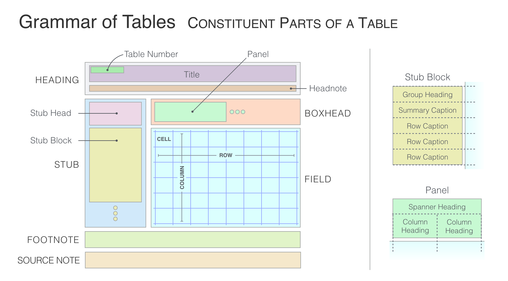
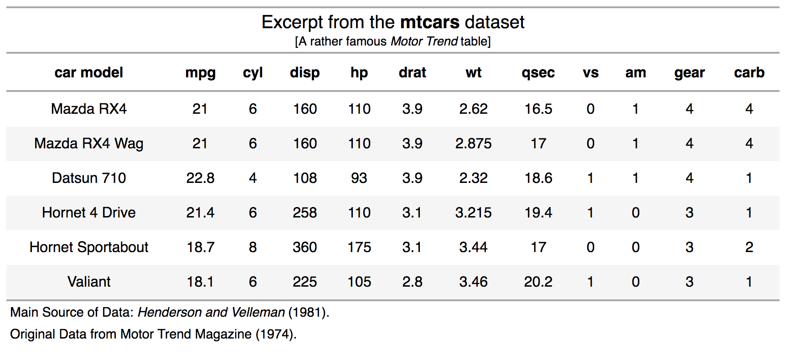
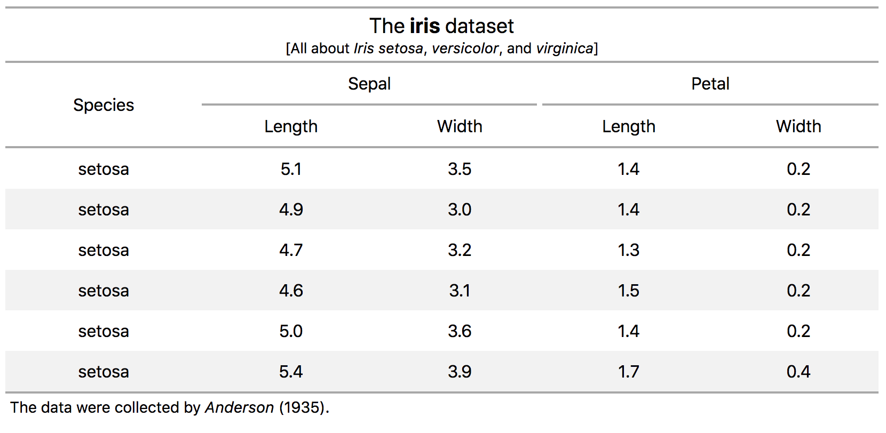
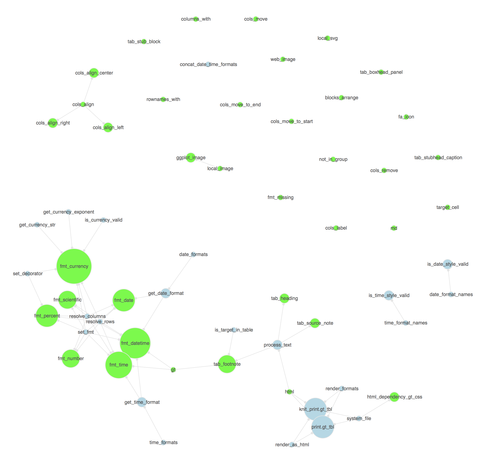

<!-- README.md is generated from README.Rmd. Please edit that file -->

```{r setup, include = FALSE}
knitr::opts_chunk$set(
  collapse = TRUE,
  comment = "#>",
  fig.path = "man/figures/README-",
  out.width = "100%"
)
```

```{r packages, message=FALSE, warning=FALSE, include=FALSE}
library(gt)
library(tidyverse)
```


## Grammar of Tables

The goal of **gt** is to allow anyone to easily build presentation tables from tabular data using the Grammar of Tables approach. We essentially want the activity of building tables to be done with a clear separation of concerns: you don't have to decide how the tabular data gets transformed and structured while also worrying about aesthetics.

The model for the constituent parts of a table can be explained in part by the following schematic:



The main structural parts of a table (and their subparts) are:

- the **heading** (optional; possibly with a **table number**, **title**, or **headnote**)
- the **stub** (contains a **stubhead** and one or more **stub blocks**)
- the **boxhead** (contains **column headings**, optionally within **panels** having one or more **spanner headings**)
- the **field** (contains *cells*, *columns*, and *rows*)
- the **footnote**
- the **source note**

The **heading** table part contains the table title and the optional table number and headnote subparts. This part is often overlooked but as it relates very closely to the tabular data it is recognized here as integral to finalized output.

The **stub** is the area to the left in a table that contains **row captions**, **summary captions**, and **group headings**. Those subparts can be grouped in a sequence of **stub blocks**. The **stubhead** provides a location for a caption that describes the **stub**. The **stub** is optional and there are many cases where a **stub** wouldn't be useful in a table.

The **boxhead** is the part that contains the **column headings**, which can themselves be supplemented by **spanner headings** (which are placed above) and contained in one or more **panels**. 

The **field** is located below the **boxhead** and right of the **stub**. Composed of *cells*, where vertical and horizontal collections are termed *columns* and *rows*.

The **footnote** area contains statements explaining information (or, lack of information) in a column, row, or one or more cells. This is done by affixing reference symbols or letters/digits to points of reference.

The **source note** area is for provision of citation information for the presented data. As it is commonly seen, the citation is preceeded by the word `Source`. 

The formalized table parts fit together well and can be used effectively for the vast majority of the tables that one may create. However, the grammar is meant to be flexibile and not at all rigid. We put forward two main considerations for tabular presentation:

1. use common sense when planning a table

2. imagine the viewing of the table from the standpoint of the user

When taking these considerations to heart, we may naturally arrive to an overarching design objective:

    The single objective is to make the display table as easy to read and to 
    understand as the nature of the material will permit.

## Examples of Display Table Creation using **gt**

The `mtcars` dataset can be suitably transformed into a simple HTML table (for sake of brevity, we'll use just the first 6 rows). We can use the `tab_create()` function to initiate the process (providing `mtcars` to the `tbl` argument), creating an HTML table object. Because `mtcars` is a data frame with rownames, a stub is automatically created. After that, a few functions can be used to add and customize the output table:

- `theme_striped()`: styles the table with a basic striped row theme
- `cols_align_center()`: center-aligns cell content in specified columns
- `tab_stubhead_caption()`: adds a caption to the stubhead (the box in the top-left of the table)
- `tab_heading()`: an opportunity to add a title and, optionally, a headnote and a table number
- `tab_source_note()`: not really a footnote, but a specialized note concerned with the source of the data presented

```{r}

# 1 - we take the first six rows of `datasets::mtcars` data.frame
# 2 - the 'striped' theme is applied
# 3 - we are formatting numbers in 4 columns to have 1 decimal place
# 4 - we are formatting numbers in the `wt` column to have 3 decimal places
# 5 - all `numeric` values are right aligned
# 6 - the dataset has rownames so they've been moved to the stub;
#     here, we supply a stubhead caption
# 7 - a heading is added
# 8,9 - two source notes are added
mtcars_tbl <-
  tab_create(tbl = mtcars[1:6, ]) %>%  # 1
  theme_striped() %>%  # 2
  fmt_number(
    columns = c("mpg", "disp", "drat", "qsec"),
    decimals = 1
    ) %>%  # 3
  fmt_number(
    columns = "wt",
    decimals = 3
    ) %>%  # 4
  cols_align_right(types = "numeric") %>%  # 5
  tab_stubhead_caption(
    caption = "car model",
    alignment = "center") %>%  # 6
  tab_heading(
    title = "Excerpt from the **mtcars** dataset",
    headnote = "[A rather famous **Motor Trend** table]"
    ) %>%  # 7
  tab_source_note(
    source_note = "Henderson and Velleman (1981).",
    lead_in = "Main Source of Data: "
    ) %>%  # 8
  tab_source_note(
    source_note = "Motor Trend Magazine (1974).",
    lead_in = "Original Data: "
    )  # 9
```

Invoking the object interactively displays it in the Viewer. In R Markdown chunks, the object becomes an HTML table.



Let's build another table using another well-known dataset. In this table, we embrace the naming convention provided in the **iris** dataset's column names. The dot-separated column names (such as `Sepal.Length` and `Petal.Width`) provide a means to specify heading levels as `<spanner_heading>.<column_heading>`. So long as we follow this column-name pattern, we can use the `tab_boxhead_panel()` function to parse and expand the given column names into one or more boxhead panels with spanner headings and column headings.

```{r}

# 1 - we take the `datasets::iris` data.frame
# 2 - the `Species` column is moved to the start of the column series
# 3 - the 'striped' theme is applied
# 4 - we are taking the column naming format `[heading].[caption]` and
#     automatically creating spanner headings to add structure
# 5 - we are formatting numbers in the named columns to have 1 decimal place
# 6 - a heading is added
# 7 - a source note is added
iris_tbl <-
  tab_create(tbl = iris[1:6, ]) %>%  # 1
  cols_move_to_start(columns = "Species") %>%  # 2
  theme_striped() %>%  # 3
  tab_boxhead_panel(use_names = TRUE) %>%  # 4
  fmt_number(
    columns = c("Sepal.Length", "Sepal.Width", "Petal.Length", "Petal.Width"),
    decimals = 1
    ) %>%  # 5
  tab_heading(
    title = "Excerpt from the **iris** dataset",
    headnote = "[All about *Iris setosa*, *versicolor*, and *virginica*]"
    ) %>%  # 6
  tab_source_note(
    source_note = "Anderson, Edgar (1935).",
    lead_in = "The data were collected by "
    )  # 7
```

This is how the table appears:



## Package API

The package API consists of the following functions:

**Create/Modify Table Parts**

- `tab_create()` -- create gt table object
- `tab_heading()` -- add a table heading
- `tab_source_note()` -- add a source note citation
- `tab_stub()` -- add a stub to a table
- `tab_stubhead_caption()` -- add caption text to the stubhead
- `tab_stub_block()` -- arrange a table stub into blocks
- `tab_boxhead_panel()` -- arrange a table stub into blocks

**Format Data**

- `fmt_number()` -- format numeric values
- `fmt_scientific()` -- format values to scientific notation
- `fmt_percent()` -- format values as a percentage
- `fmt_currency()` -- format values as currencies
- `fmt_fraction()` -- format values to fractions
- `fmt_date()` -- format values as dates
- `fmt_time()` -- format values as times
- `fmt_datetime()` -- format values as date-times
- `fmt_uncertainty()` -- format as values with uncertainties
- `fmt_font()` -- format fonts used for values

**Modify Columns**

- `cols_align_left()` -- use left alignment
- `cols_align_center()` -- use center alignment
- `cols_align_right()` -- use right alignment
- `cols_move()` -- move one or more columns
- `cols_move_to_start()` -- move one or more columns to the start
- `cols_move_to_end()` -- move one or more columns to the end
- `cols_reorder()` -- reorder all columns
- `cols_remove()` -- remove one or more columns

**Apply Table Theme**

- `theme_striped()` -- use the striped table theme
- `theme_classical()` -- use the classical table theme
- `theme_minimal()` -- use the minimal table theme

There are more functions yet to come.

## Inner Workings

For those interested in the package design itself and especially how the **gt** functions relate to each other, here is a graph showing just that:



The green nodes represent those functions that are exported. The relative sizing of nodes is scaled the number of package functions called by each (no matter whether the function is exported or not). Each edge represents the relationship `called_in`.

## Code of Conduct

Please note that this project is released with a [Contributor Code of Conduct](CODE_OF_CONDUCT.md). By participating in this project you agree to abide by its terms.

## License

MIT &copy; RStudio

