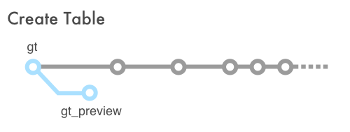
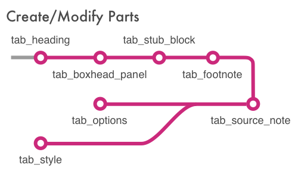
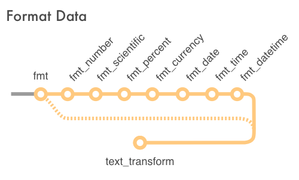
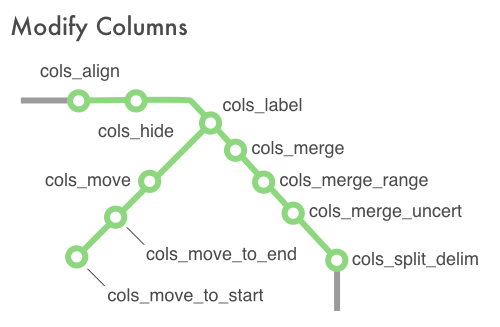
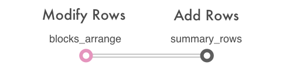
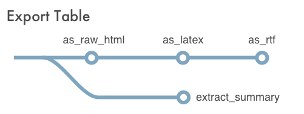

<!-- README.md is generated from README.Rmd. Please edit that file -->

```{r setup, include = FALSE}
knitr::opts_chunk$set(
  collapse = TRUE,
  comment = "#>",
  fig.path = "man/figures/README-",
  out.width = "100%"
)
```

```{r packages, message=FALSE, warning=FALSE, include=FALSE}
library(gt)
library(tidyverse)
```

<p align="center"></p>

<p align="center">[](https://www.tidyverse.org/lifecycle/#maturing)
[](https://cran.r-project.org/package=gt)
[](https://travis-ci.com/rstudio/gt)
[](https://codecov.io/github/rstudio/gt?branch=master)</p>

With the **gt** package, anyone can make wonderful-looking tables using the **R** programming language. 

***
***


***
***

The **gt** philosophy: we can construct a wide variety of useful tables with a cohesive set of table parts. These include the table heading, the boxhead, the stub, summary rows, and footnotes.

***
***


***
***

You decide which table parts you need for the task at hand with a API that is both straightforward yet powerful.

***
***

<p align="center"></p>

<p align="center"></p>

<p align="center"></p>

<p align="center"></p>

<p align="center"></p>

<p align="center"></p>

***

## Code of Conduct

Please note that this project is released with a [Contributor Code of Conduct](CODE_OF_CONDUCT.md). By participating in this project you agree to abide by its terms.

## License

MIT &copy; RStudio, Inc.
