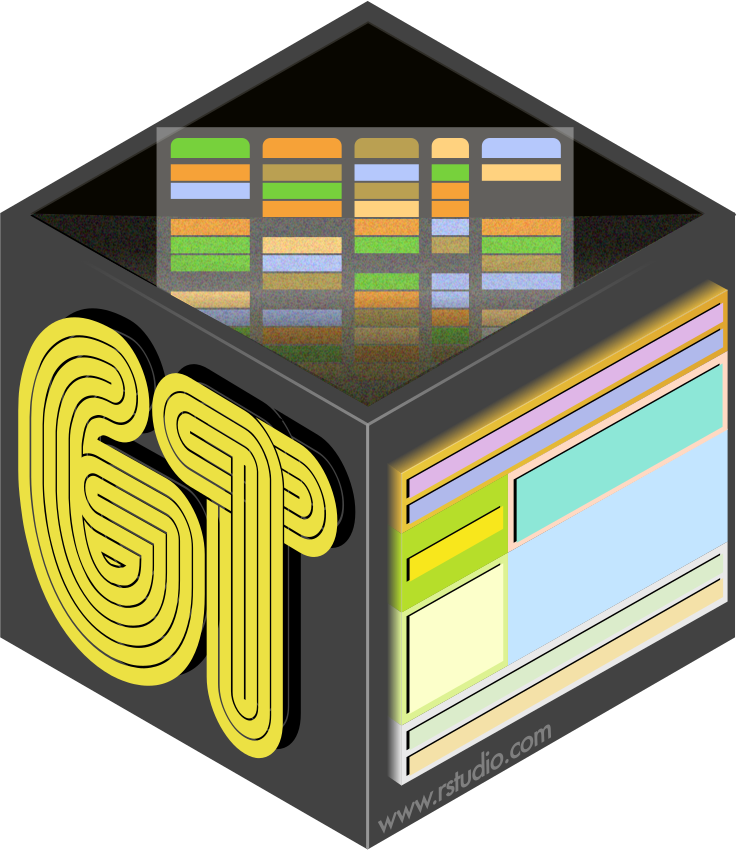

<!-- README.md is generated from README.Rmd. Please edit that file -->

```{r setup, include = FALSE}
knitr::opts_chunk$set(
  collapse = TRUE,
  comment = "#>",
  fig.path = "man/figures/README-",
  out.width = "100%"
)
```

```{r packages, message=FALSE, warning=FALSE, include=FALSE}
library(gt)
library(tidyverse)
```

<p align="center"></p>

<p align="center">[](https://www.tidyverse.org/lifecycle/#maturing)
[](https://cran.r-project.org/package=gt)
[](https://travis-ci.com/rstudio/gt)
[](https://codecov.io/github/rstudio/gt?branch=master)</p>

With the **gt** package, anyone can make wonderful-looking tables using the **R** programming language. The **gt** philosophy: we can construct a wide variety of useful tables with a cohesive set of table parts. These include the *table header*, the *stub*, the *stub head*, the *column labels*, the *table body*, and the *table footer*.

<p align="center"></p>

It all begins with preprocessed **table data** (be it a tibble or a data frame). You decide how to compose your **gt table** with the elements you need for the task at hand. Output can either be in the form of **HTML**, **LaTeX**, or **RTF**. All work beautifully inside **R Markdown** documents.

The **gt** API is designed to be both straightforward yet powerful. The emphasis is on simple functions for the everyday display table needs. However, should you need more customizability, there are options to make that possible.

<p align="center"></p>

***


<h5 align="center">Code of Conduct</h5>

<h6 align="center">Please note that this project is released with a [Contributor Code of Conduct](CODE_OF_CONDUCT.md). By participating in this project you agree to abide by its terms.</h6>

<h5 align="center">License</h5>

<h6 align="center">MIT &copy; RStudio, Inc.</h6>

