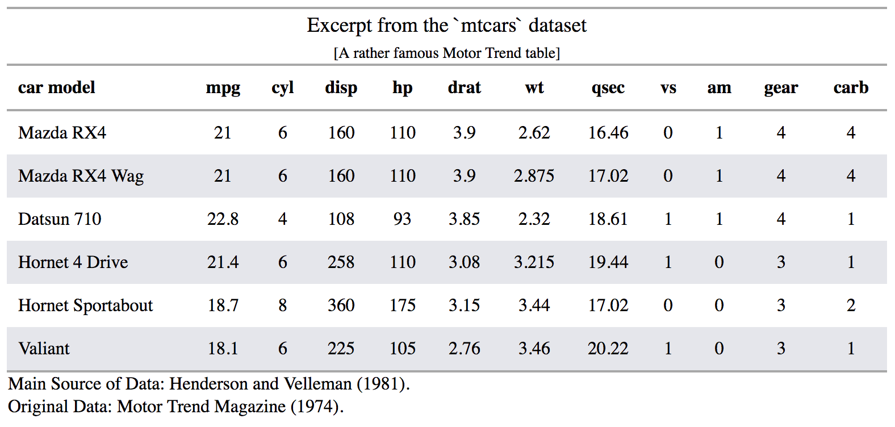

<!-- README.md is generated from README.Rmd. Please edit that file -->

```{r setup, include = FALSE}
knitr::opts_chunk$set(
  collapse = TRUE,
  comment = "#>",
  fig.path = "man/figures/README-",
  out.width = "100%"
)
```

## Grammar of Tables

The goal of **gt** is to allow anyone to easily build presentation tables from tabular data using the Grammar of Tables approach. We essentially want the activity of building tables to be done with a clear separation of concerns: you don't have to decide how the tabular data gets transformed and structured while also worrying about aesthetics.

While the Grammar of Tables API is still undergoing a first draft, the model for the constituent parts of a table has been tentatively put forward. The schematic below provides an outline of how the table components fit together.


The main structural parts of a table (and their subparts) are:

- the **heading** (optional; possibly with a **table number**, **title**, or **headnote**)
- the **stub** (contains a **stubhead** and one or more **stub blocks**)
- the **boxhead** (contains **column headings**, optionally within **panels** having one or more **spanner headings**)
- the **field** (contains *cells*, *columns*, and *rows*)
- the **footnote**
- the **source note**

The **heading** table part contains the table title and the optional table number and headnote subparts. This part is often overlooked but as it relates very closely to the tabular data it is recognized here as integral to finalized output.

The **stub** is the area to the left in a table that contains **row captions**, **summary captions**, and **group headings**. Those subparts can be grouped in a sequence of **stub blocks**. The **stubhead** provides a location for a caption that describes the **stub**.

The **boxhead** is the part that contains the **column headings**, which can themselves be supplemented by **spanner headings** (which are placed above) and contained in one or more **panels**. 

The **field** is located below the **boxhead** and right of the **stub**. Composed of *cells*, where vertical and horizontal collections are termed *columns* and *rows*.

The **footnote** area contains statements explaining information (or, lack of information) in a column, row, or one or more cells. This is done by affixing reference symbols or letters/digits to points of reference.

The **source note** area is for provision of citation information for the presented data. As it is commonly seen, the citation is preceeded by the word `Source`. 

## Example

The `mtcars` dataset can be suitably transformed into a simple HTML table. We can use the `gt()` function to initiate the process (providing `mtcars` to the `tbl` argument), creating an HTML table object. We can apply a theme such as the basic striped row theme with `apply_theme_striped()`. The stubhead caption would otherwise be an empty box in the top-left of the table unless we specify some text to be placed there. We can use `add_stubhead_caption()` to provide the text for that part of the table. Finally, we add a heading to the table with `add_heading()`, where title text and a headnote (which is an optional statement that follows the title) is specified.

```{r}
library(gt)

mtcars_tbl <-
  gt(tbl = mtcars) %>%
  apply_theme_striped() %>%
  add_stubhead_caption(text = "car model") %>%
  add_heading(
    title = "The `mtcars` dataset",
    headnote = "[A rather famous Motor Trend table]")
```

The HTML table object is transformed to HTML with the `emit_html()` function. This works well inside an R Markdown code chunk since the table will appear when the document is rendered to HTML.

```r
mtcars_tbl %>% emit_html()
```

We can also preview the table in the Viewer pane with `render_table()`:

```r
mtcars_tbl %>% render_table()
```



## Code of Conduct

Please note that this project is released with a [Contributor Code of Conduct](CODE_OF_CONDUCT.md). By participating in this project you agree to abide by its terms.

## License

MIT &copy; RStudio

