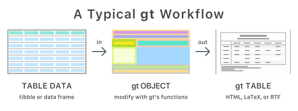
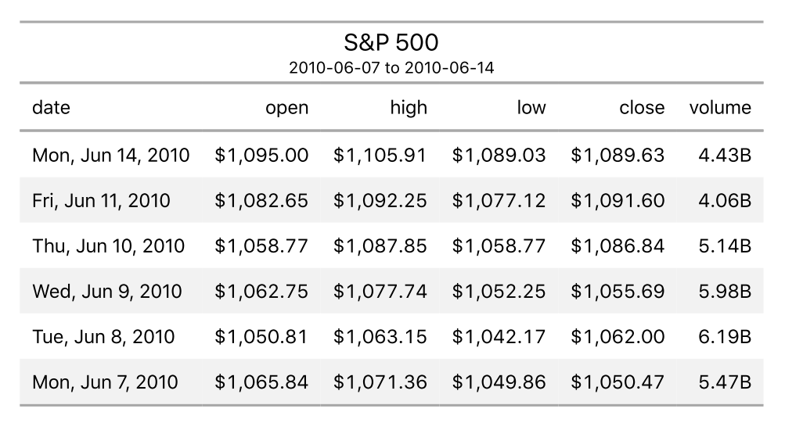
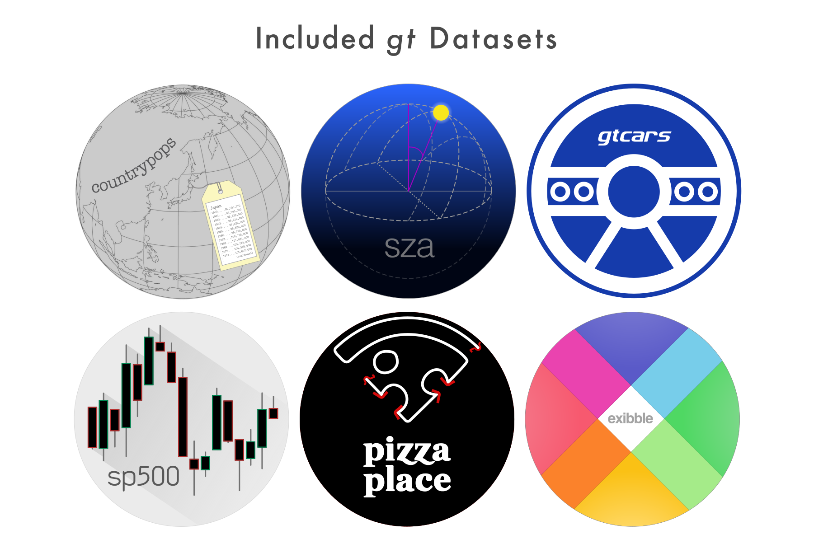
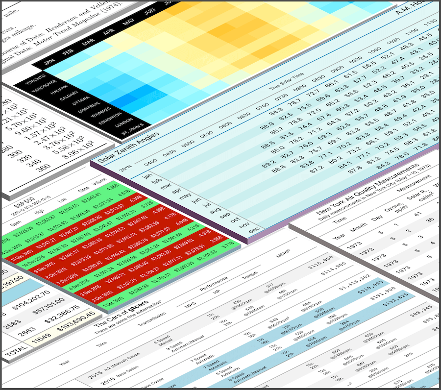

<!-- README.md is generated from README.Rmd. Please edit that file -->

```{r setup, include = FALSE}
knitr::opts_chunk$set(
  collapse = TRUE,
  comment = "#>",
  fig.path = "man/figures/README-",
  out.width = "100%"
)
```

```{r packages, message=FALSE, warning=FALSE, include=FALSE}
library(gt)
library(tidyverse)
```

# gt 

[](https://www.tidyverse.org/lifecycle/#maturing)
[](https://cran.r-project.org/package=gt)
[](https://travis-ci.com/rstudio/gt)
[](https://ci.appveyor.com/project/rstudio/gt)
[](https://codecov.io/github/rstudio/gt?branch=master)

With the **gt** package, anyone can make wonderful-looking tables using the **R** programming language. The **gt** philosophy: we can construct a wide variety of useful tables with a cohesive set of table parts. These include the *table header*, the *stub*, the *stub head*, the *column labels*, the *table body*, and the *table footer*.

<p align="center"></p>

It all begins with preprocessed **table data** (be it a tibble or a data frame). You decide how to compose your **gt table** with the elements you need for the task at hand. Output can either be in the form of **HTML**, **LaTeX**, or **RTF**. All work beautifully inside **R Markdown** documents.

<p align="center"></p>

The **gt** API is designed to be both straightforward yet powerful. The emphasis is on simple functions for the everyday display table needs. Here is a brief example of how to use **gt** to create an HTML **gt Table** from the included `sp500` dataset:

```r
library(gt)
library(tidyverse)
library(glue)

# Define the start and end dates for the data range
start_date <- "2010-06-07"
end_date <- "2010-06-14"

# Create a gt table based on preprocessed
# `sp500` table data
sp500 %>%
  dplyr::filter(date >= start_date & date <= end_date) %>%
  dplyr::select(-adj_close) %>%
  dplyr::mutate(date = as.character(date)) %>%
  gt() %>%
  tab_header(
    title = "S&P 500",
    subtitle = glue::glue("{start_date} to {end_date}")
  ) %>%
  fmt_date(
    columns = vars(date),
    date_style = 3
  ) %>%
  fmt_currency(
    columns = vars(open, high, low, close),
    currency = "USD"
  ) %>%
  fmt_number(
    columns = vars(volume),
    scale_by = 1 / 1E9,
    pattern = "{x}B"
  )
```

<p align="center"></p>

There are six datasets included in **gt**: `countrypops`, `sza`, `gtcars`, `sp500`, `pizzaplace`, and `exibble`. All of them are useful for experimenting with the API.

<p align="center"></p>

Beyond this simple example, there are many functions available in **gt** that make it possible to create highly customized tables.

<p align="center"></p>

Want to try this out? First and foremost, the **gt** package is used in an R environment, so, if you don't have an R installation, it can be obtained from the [**Comprehensive R Archive Network (CRAN)**](https://cran.r-project.org/). For the best experience in working with R, use the [**RStudio Desktop IDE**](https://www.rstudio.com/products/rstudio/).

You can install the development version of **gt** from **GitHub**. Use the following in the R console to install **gt**.

```{r eval=FALSE}
install.packages("devtools")
remotes::install_github("rstudio/gt")
```

If you encounter a bug, have usage questions, or want to share ideas to make this package better, feel free to file an [issue](https://github.com/rstudio/gt/issues).

***



***

<h4 align="center">Code of Conduct</h4>

<h6 align="center">Please note that this project is released with a [Contributor Code of Conduct](CODE_OF_CONDUCT.md).<br>By participating in this project you agree to abide by its terms.</h6>

<h4 align="center">License</h4>

<h6 align="center">MIT &copy; RStudio, Inc.</h6>

