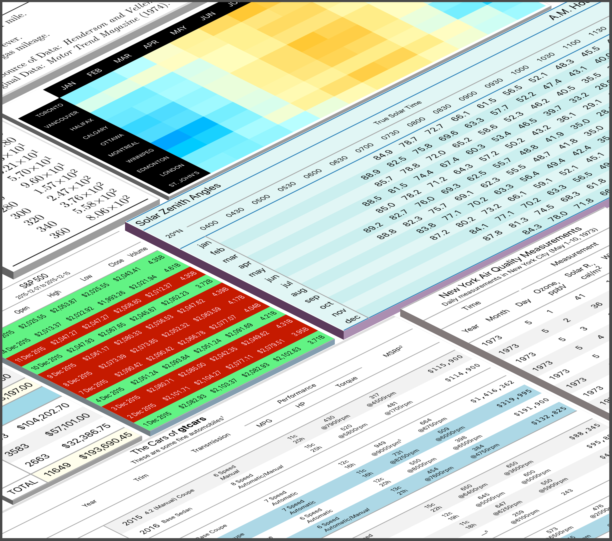

<div align="center">

<hr style="color:transparent" />
<a href='https://gt.rstudio.com/'></a>
<hr style="color:transparent"/>
<!-- badges: start -->
<a href="https://cran.r-project.org/package=gt"></a>
<a href="https://github.com/rstudio/gt/actions/workflows/R-CMD-check.yaml"></a>
<a href="https://app.codecov.io/gh/rstudio/gt?branch=master"></a>

<a href="https://bestpractices.coreinfrastructure.org/projects/5593"></a>
<a href="https://www.repostatus.org/#active"></a>
<a href="https://CRAN.R-project.org/package=gt"></a>
<a href="https://CRAN.R-project.org/package=gt"></a>


[](https://discord.gg/Ux7nrcXHVV)

[](https://rstudio.cloud/project/779965)

<a href="https://www.contributor-covenant.org/version/2/1/code_of_conduct.html"></a>
<!-- badges: end -->
<hr style="color:transparent" />
<br />
</div>

With the **gt** package, anyone can make wonderful-looking tables using
the **R** programming language. The **gt** philosophy: we can construct
a wide variety of useful tables with a cohesive set of table parts.
These include the *table header*, the *stub*, the *column labels* and
*spanner column labels*, the *table body*, and the *table footer*.

<div align="center">

</div>

It all begins with **table data** (be it a tibble or a data frame). You
then decide how to compose your **gt table** with the elements and
formatting you need for the task at hand. Finally, the table is rendered
by printing it at the console, including it in an R Markdown document,
or exporting to a file using `gtsave()`. Currently, **gt** supports the
**HTML**, **LaTeX**, and **RTF** output formats.

<div align="center">

</div>

<hr />

The **gt** package is designed to be both straightforward yet powerful.
The emphasis is on simple functions for the everyday display table
needs. Here is a brief example of how to use **gt** to create a table
from the included `sp500` dataset:

``` r
library(gt)
library(tidyverse)
library(glue)

# Define the start and end dates for the data range
start_date <- "2010-06-07"
end_date <- "2010-06-14"

# Create a gt table based on preprocessed
# `sp500` table data
sp500 %>%
  filter(date >= start_date & date <= end_date) %>%
  select(-adj_close) %>%
  gt() %>%
  tab_header(
    title = "S&P 500",
    subtitle = glue("{start_date} to {end_date}")
  ) %>%
  fmt_date(
    columns = date,
    date_style = 3
  ) %>%
  fmt_currency(
    columns = c(open, high, low, close),
    currency = "USD"
  ) %>%
  fmt_number(
    columns = volume,
    suffixing = TRUE
  )
```

<div align="center">

</div>

There are six datasets included in **gt**: `countrypops`, `sza`,
`gtcars`, `sp500`, `pizzaplace`, and `exibble`. All of them are useful
for experimenting with **gt**’s functions.

Beyond this simple example, there are many functions available in **gt**
for creating super-customized tables. For much more information on these, visit the
[documentation website](https://gt.rstudio.com/) or take
a *Test Drive* in the [Posit Cloud project](https://rstudio.cloud/project/779965).

## DISCUSSIONS

Let's talk about making tables with **gt** in
[*Discussions*](https://github.com/rstudio/gt/discussions)!
It's a great place to ask questions about how to use the package, discuss
some ideas, engage with others, and much more!

## INSTALLATION

The **gt** package can be installed from **CRAN** with:

``` r
install.packages("gt")
```

You can also choose to install the development version of **gt** from
**GitHub**:

``` r
devtools::install_github("rstudio/gt")
```

If you encounter a bug, have usage questions, or want to share ideas to
make this package better, please feel free to file an
[issue](https://github.com/rstudio/gt/issues).

-----

## How **gt** fits in with Other Packages that Generate Display Tables

The **gt** package joins a burgeoning collection of packages for display
table generation. Why another? We feel that there is enough room in this
space to innovate further. Here are some of the ways that **gt**
contributes to this ecosystem:

  - the interface is high-level and declarative (general instructions
    versus very specific)
  - the formatting options are ‘batteries included’ (scientific
    notation, uncertainty, ranges, percentages, suffixes, localized
    currency, dates/times + much more)
  - there is excellent, pain-free support for footnotes
  - the output is ‘camera-ready’
  - multiple output formats are supported with the same declarative
    interface
  - the API closely follows tidyverse conventions by adhering to the
    [tidyverse style guide](https://style.tidyverse.org)
  - there’s a focus on making the package documentation and examples the
    best they can be
  - rigorous QA/QC measures: high test coverage for automated tests, and
    thorough manual testing by QA engineers (with every proposed code
    change)

While **gt** is trying to do something different with its own interface,
it may not suit your specific needs. Here is a listing of other leading
table-making **R** packages, with links to their respective project
pages:

  - **knitr** ([GITHUB](https://github.com/yihui/knitr), [WEBSITE](https://yihui.org/knitr/))
  - **kableExtra** ([GITHUB](https://github.com/haozhu233/kableExtra), [WEBSITE](https://haozhu233.github.io/kableExtra/))
  - **formattable** ([GITHUB](https://github.com/renkun-ken/formattable), [WEBSITE](https://renkun-ken.github.io/formattable/))
  - **DT** ([GITHUB](https://github.com/rstudio/DT), [WEBSITE](https://rstudio.github.io/DT/))
  - **pander** ([GITHUB](https://github.com/Rapporter/pander), [WEBSITE](http://rapporter.github.io/pander/))
  - **huxtable** ([GITHUB](https://github.com/hughjonesd/huxtable), [WEBSITE](https://hughjonesd.github.io/huxtable/))
  - **reactable** ([GITHUB](https://github.com/glin/reactable), [WEBSITE](https://glin.github.io/reactable/))
  - **flextable** ([GITHUB](https://github.com/davidgohel/flextable), [WEBSITE](https://davidgohel.github.io/flextable/))
  - **ftextra** ([GITHUB](https://github.com/atusy/ftExtra), [WEBSITE](https://ftextra.atusy.net/))
  - **pixiedust** ([GITHUB](https://github.com/nutterb/pixiedust))
  - **tangram** ([GITHUB](https://github.com/spgarbet/tangram))
  - **ztable** ([GITHUB](https://github.com/cardiomoon/ztable))
  - **condformat** ([GITHUB](https://github.com/zeehio/condformat))
  - **stargazer** ([CRAN](https://CRAN.R-project.org/package=stargazer))
  - **xtable** ([CRAN](https://CRAN.R-project.org/package=xtable))

## Code of Conduct

Please note that the gt project is released with a [contributor code of
conduct](https://www.contributor-covenant.org/version/2/1/code_of_conduct.html).<br>By
participating in this project you agree to abide by its terms.

## 📄 License

**gt** is licensed under the MIT license. See the
[`LICENSE.md`](LICENSE.md) file for more details.

© Posit Software, PBC.

## 🏛️ Governance

This project is primarily maintained by [Rich Iannone](https://twitter.com/riannone). Other authors may occasionally assist with some of these duties.

<hr>

<div align="center">

</div>

<hr>
