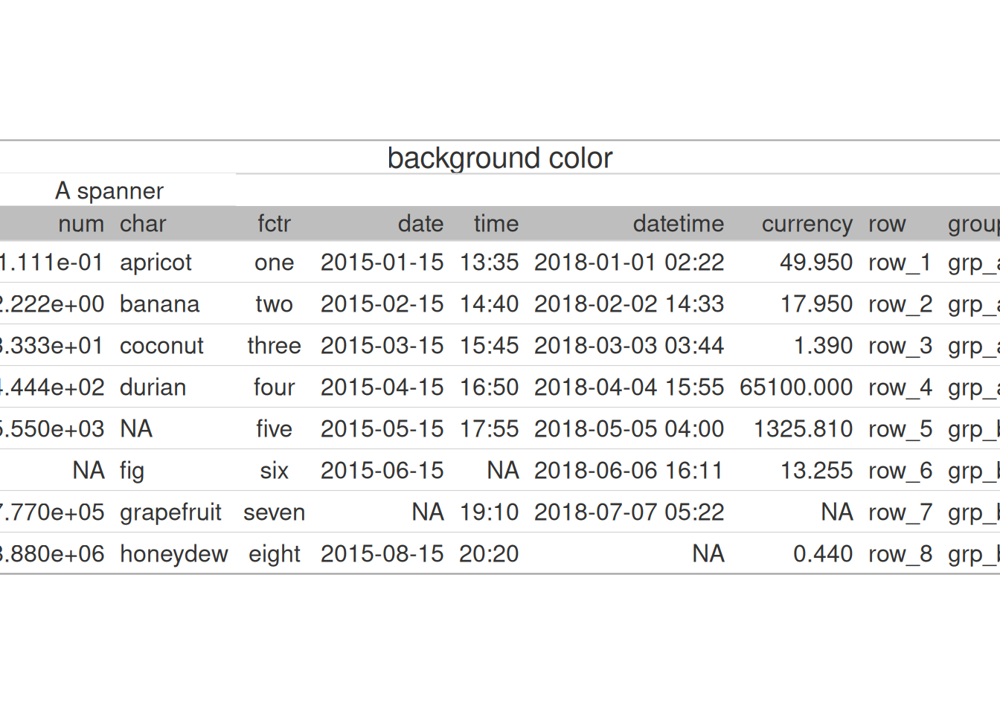
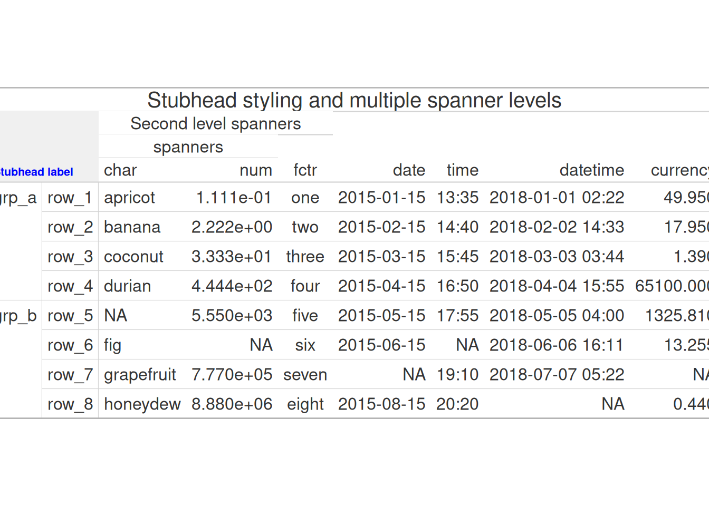

# gt visual tests

Code

``` r
library(gt)
```

You can find [visual tests for
LaTeX](https://gt.rstudio.com/gt-latex.pdf)

## Background color

Code

``` r
tab <- exibble |>
  gt() |>
  tab_options(
    column_labels.background.color = "gray"
  ) |>
  tab_spanner(c(num, char), label = "A spanner") |>
  tab_header(title = "background color")
```

- [html](#tabset-1-1)
- [interactive](#tabset-1-2)
- [plot](#tabset-1-3)

&nbsp;

- [TABLE]

background color



## Spanner and Stubhead

Code

``` r
tab <- exibble |>
  gt(rowname_col = "row", groupname_col = "group", row_group_as_column = TRUE) |>
  tab_spanner("spanners", c(char, num)) |>
  tab_spanner("Second level spanners", c(char, num, fctr)) |>
  tab_stubhead("Stubhead label") |>
  tab_style(
    style = list(cell_fill("#f0f0f0"), cell_text(weight = "bold", size = "small", color = "blue")),
    cells_stubhead()
  ) |> 
  tab_header(title = "Stubhead styling and multiple spanner levels")
```

- [html](#tabset-2-1)
- [interactive](#tabset-2-2)
- [plot](#tabset-2-3)

&nbsp;

- [TABLE]

Stubhead styling and multiple spanner levels



## Complete output

Code

``` r
tab <- pizzaplace |>
  dplyr::filter(type %in% c("classic", "veggie")) |>
  dplyr::group_by(type, size) |>
  dplyr::summarize(
    sold = dplyr::n(),
    income = sum(price),
    .groups = "drop"
  ) |>
  gt(rowname_col = "size", groupname_col = "type") |>
  tab_header(title = "Complete output") |>
  fmt_integer(columns = sold) |>
  fmt_currency(columns = income) |>
  summary_rows(
    fns = list(label = "All Sizes", fn = "sum"),
    side = c("top"),
    fmt = list(
      ~ fmt_integer(., columns = sold),
      ~ fmt_currency(., columns = income)
    )
  ) |>
  tab_options(
    summary_row.background.color = "gray95",
    row_group.as_column = TRUE
  ) |>
  tab_stub_indent(
    rows = everything(),
    indent = 2
  ) |>
  grand_summary_rows(
    columns = c("sold", "income"),
    fns = list(Sum ~ sum(.)),
    fmt = ~ fmt_number(.)
  ) |>
  tab_caption("Here be caption text") |>
  tab_spanner(
    label = "Spanner",
    columns = c("sold", "income")
  ) |>
  tab_stubhead("Stubhead label") |>
  tab_source_note("Source: the pizzaria") |>
  tab_footnote("Pineapples not included")
```

- [html](#tabset-3-1)
- [interactive](#tabset-3-2)
- [plot](#tabset-3-3)

&nbsp;

- [TABLE]

  Here be caption text

Complete output

Source: the pizzaria


