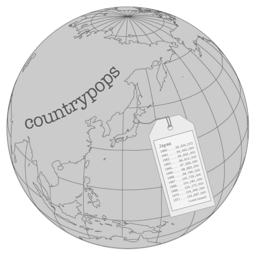

```{r options, message=FALSE, warning=FALSE, include=FALSE}
knitr::opts_chunk$set(
  collapse = TRUE,
  comment = "#>")

library(gt)
library(dplyr)
library(tidyr)
```

The **gt** package comes with six built-in datasets for experimenting with the **gt** API: `countrypops`, `sza`, `gtcars`, `sp500`, `pizzaplace`, and `exibble`. While each dataset has different subject matter, all of them will be used to develop examples with consistent syntax.




Each dataset is stored as a tibble, ranging from very small (like `exibble`, an example tibble of 8 rows) to quite large in size (e.g., at nearly 50,000 rows: `pizzaplace`). Larger are typically impractical as display tables but they provide opportunities for preprocessing through tidyverse tools like **dplyr** and **tidyr** upstream of **gt**. 

In many **gt** workflows, there will be preparation work like this where the creation of the input table and any salient information (e.g., metadata for footnotes) will be done alongside the preparation of the display table.

Next, we'll show minimal examples of tables that can be created with each of these datasets. The hope is that this collection of examples will inspire the creation of much more interesting display tables with **gt**.

### `countrypops`

This dataset provides the total populations of 215 countries on a yearly basis, from 1960 to 2017. The source data comes from the [World Bank](https://data.worldbank.org/indicator/SP.POP.TOTL), where it has been cleaned and tidied up for inclusion into this package. Each row contains a population value for a country in a given year, where `NA` values indicate that a country did not exist for that particular year.

The `countrypops` dataset is a tibble with 12,470 rows and 5 variables. Here are explanations for each of the variables: 

```{r countrypops_make_data_dictionary, echo=FALSE}
countrypops_ddtab <-
  dplyr::tribble(
    ~Column,          ~Type,  ~Description,
    "country_name",   "chr", "Name of the country",
    "country_code_2", "chr", "The 2-letter ISO 3166-1 country code",
    "country_code_3", "chr", "The 3-letter ISO 3166-1 country code",
    "year",           "int", "The year for the population estimate",
    "population",     "int", "The population estimate, midway through the year",
  ) %>%
  gt() %>%
  tab_style(
    style = apply_styles(text_font = "Courier"),
    locations = list(
      cells_data(columns = "Column"),
      cells_data(columns = "Type"))
  ) %>%
  tab_options(row.padding = "5px")
```

```{r countrypops_ddtab, echo = FALSE}
countrypops_ddtab
```

#### A `countrypops` Example

The table that we'll create from `countrypops` will meet these requirements:

1. we will use countries from Oceania
2. countries in different regions of Oceania will be grouped together
3. populations will be given for the 1995, 2005, and 2015 years only, and they will appear as separate columns with a spanner group column stating that these columns refer to population values
4. population figures will be formatted to contain commas
5. a title will be provided

```{r countrypops}
# Get vectors of 2-letter country codes for
# each region of Oceania
Australasia <- c("AU", "NZ")
Melanesia <- c("NC", "PG", "SB", "VU")
Micronesia <- c("FM", "GU", "KI", "MH", "MP", "NR", "PW")
Polynesia <- c("PF", "WS", "TO", "TV")

# Create a gt table based on a proprocessed `countrypops`
countrypops %>%
  dplyr::filter(country_code_2 %in% c(
    Australasia, Melanesia, Micronesia, Polynesia)
  ) %>%
  dplyr::filter(year %in% c(1995, 2005, 2015)) %>%
  dplyr::mutate(region = case_when(
    country_code_2 %in% Australasia ~ "Australasia",
    country_code_2 %in% Melanesia ~ "Melanesia",
    country_code_2 %in% Micronesia ~ "Micronesia",
    country_code_2 %in% Polynesia ~ "Polynesia",
  )) %>%
  tidyr::spread(key = year, value = population) %>%
  dplyr::arrange(region, desc(`2015`)) %>%
  dplyr::select(-starts_with("country_code")) %>%
  gt(
    rowname_col = "country_name",
    groupname_col = "region"
  ) %>%
  tab_heading("Populations of Oceania's Countries in 1995, 2005, and 2015") %>%
  tab_boxhead_panel(
    group = "Total Population",
    columns = c("1995", "2005", "2015")
  ) %>%
  fmt_number(
    columns = TRUE,
    decimals = 0,
    use_seps = TRUE
  )
```

### `sza`

The solar zenith angle is one measure of the solar position. It can be thought of as 'height' of the sun in relation to an observer. A solar zenith angle of 0&deg; indicates that the sun is directly overhead (a different solar angle, the *solar altitude angle*, is 90&deg; in this instance). With the sun at the horizontal (e.g., during sunrise/sunset) we observe the solar zenith angle to be around 90&deg; (there is the matter of atmospheric refraction). During nighttime, solar zenith angles in the range of 90&ndash;180 are possible (again, depending on the location of the observer).

The `sza` dataset has calculated values for the solar zenith angles every 30 minutes from 04:00 to 12:00 (true solar time). Temporally, these calculations are for the 1st of every month of the year. Spatially, the observer is located at somewhere along latitudes 20&deg;N, 30&deg;N, 40&deg;N, and 50&deg;N (because we are using true solar time, the longitude is unimportant). This is quite an extensive topic, and more information can be found by using `?sza` in the R console or by visiting [this page](https://en.wikipedia.org/wiki/Solar_zenith_angle).

```{r sza_make_data_dictionary, echo=FALSE}
sza_ddtab <-
  dplyr::tribble(
    ~Column,      ~Type,  ~Description,
    "latitude",   "dbl", "The latitude in decimal degrees for the observations",
    "month",      "fct", "The measurement month; all calculations where conducted for the first day of each month",
    "tst",        "chr", "The true solar time at the given latitude and date (first of month) for which the solar zenith angle is calculated",
    "sza",        "dbl", "The solar zenith angle in degrees, where NAs indicate that sunrise hadn't yet occurred by the tst value",
  ) %>%
  gt() %>%
  tab_style(
    style = apply_styles(text_font = "Courier"),
    locations = list(
      cells_data(columns = "Column"),
      cells_data(columns = "Type"))
  ) %>%
  tab_options(row.padding = "5px")
```

```{r sza_ddtab, echo = FALSE}
sza_ddtab
```


The table that we'll create from `sza` will meet these requirements:

1. we will filter the data to just use the 20&deg;N data and remove the `latitude` column
2. `NA` values from `sza` column are to be removed
3. we will reshape the table so that columns of `tst` (true solar time) contain angles in degrees (from the `sza` column)
4. the **gt** table will have the `month`s as row captions in the stub
5. missing values will be replaced with an empty string (so that those cells are blank)
6. a stubhead caption will state what's inside the stubs (months, at 20&deg;N)
7. the table will have a heading decorated with the HTML *Black Sun with Rays* (&#x2600;) symbol
8. to fit the large amount of data in a smaller area, use some table options to reduce text size and row padding

```{r sza}

sza %>%
  dplyr::filter(latitude == 20) %>%
  dplyr::select(-latitude) %>%
  dplyr::filter(!is.na(sza)) %>%
  tidyr::spread(key = "tst", value = sza) %>%
  gt(rowname_col = "month") %>%
  fmt_missing(
    columns = TRUE,
    missing_text = ""
  ) %>%
  tab_stubhead_caption(caption = html("month<br>(20&deg;N)")) %>%
  tab_heading(html("&#x2600; Solar Zenith Angles &#x2600;")) %>%
  tab_options(
    boxhead.font.size = "smaller",
    table.font.size = "smaller",
    row.padding = px(3)
  )
```

### `gtcars`

The `gtcars` dataset takes off where `mtcars` left off. It contains 47 cars from the 2014-2017 model years. Many of the `gtcars` vehicles are grand tourers. Indeed, many of these provide the ability to cross an entire continent at speed and in comfort yet, when it's called for, they will allow you to experience driving thrills. The chassis and suspension are in most cases top-notch and supply superb handling and roadholding on all routes one would conceivably encounter during the grand touring experience. The two plus two (2 + 2) seating configuration is smartly designed to deliver comfort for a driver and passenger, adequate space for luggage, and have room to spare.

The table that we'll create from `gtcars` will meet these requirements:

1. only include German cars
2. limit dataset to top two most expensive offerings from each manufacturer
3. the information included will be the manufacturer (`mfr`), the car model (`model`), the `drivetrain`, and the price (`msrp`)
4. add a table title
5. combine the car make and model into a single column
6. capitalize the `drivetrain` text
7. format the prices with `fmt_currency()`
8. Relabel the column headings
9. Add two footnotes that explain the `drivetrain` abbreviations and that state the currency of the `msrp` prices; ensure that the footnote glyphs are lowercase letters 

```{r gtcars}

gtcars %>%
  dplyr::filter(ctry_origin == "Germany") %>%
  dplyr::group_by(mfr) %>%
  dplyr::top_n(2, msrp) %>%
  dplyr::ungroup() %>%
  dplyr::select(mfr, model, drivetrain, msrp) %>%
  gt() %>%
  tab_heading(title = "Select German Automobiles") %>%
  cols_merge(
    col_1 = "mfr",
    col_2 = "model"
  ) %>%
  text_transform(
    locations = cells_data(columns = vars(drivetrain)),
    fn = function(x) toupper(x)
  ) %>%
  fmt_currency(
    columns = vars(msrp),
    currency = "USD",
    decimals = 0,
    use_seps = TRUE
  ) %>%
  tab_footnote(
    footnote = "Prices in USD.",
    locations = cells_boxhead(columns = vars(msrp))
  ) %>%
  tab_footnote(
    footnote = "AWD = All Wheel Drive, RWD = Rear Wheel Drive.",
    locations = cells_boxhead(columns = vars(drivetrain))
  ) %>%
  tab_options(footnote.glyph = letters) %>%
  cols_label(
    mfr = "Car",
    drivetrain = "Drivetrain",
    msrp = "MSRP"
  )
```

### `sp500`

The S&P 500 is an capitalization-weighted index of about 500 leading companies (where bigger companies have more influence within the index) that have common stock listed in either the NYSE or NASDAQ markets. The companies chosen are intended to provide representation of the U.S. economy. This index is a managed list (managed by S&P Dow Jones Indices LLC) with occasional changes of the constituent companies based on their performance and changes in the economy.

There is daily S&P 500 data available in the `sp500` dataset, with daily indicators (price statistics, `volume`, etc.) from 1950 to 2015, inclusive.

The table that we'll create from `sp500` will meet these requirements:

1. only data from `2010-06-01` to `2010-06-15` will be used 
2. the adjusted close `adj_close` column won't be included
3. a title and headnote will be added to describe the contents of the table
4. the column labels will be put in title case
5. the `date` column will be formatted with `fmt_date()`
6. the price columns will be formatted with `fmt_currency()`
7. the `volume` column will be formatted with `fmt_number()` (abbreviating the figures)
8. up- and down-pointing triangles (in green and red) will be added alongside the `close` price as appropriate

```{r sp500}

# Define the start and end dates for the data range
start_date <- "2010-06-01"
end_date <- "2010-06-15"

# The HTML decimal references for the black
# up- and down-pointing triangles are: #9650 and #9660;
# use an in-line style to apply color
up_arrow <- "<span style=\"color:green\">&#9650;</span>"
down_arrow <- "<span style=\"color:red\">&#9660;</span>"

# Create a gt table based on a proprocessed `sp500`
sp500 %>%
  dplyr::filter(date >= start_date & date <= end_date) %>%
  dplyr::select(-adj_close) %>%
  dplyr::mutate(date = as.character(date)) %>%
  gt() %>%
  tab_heading(
    title = "S&P 500",
    headnote = glue::glue("{start_date} to {end_date}")
  ) %>%
  fmt_date(
    columns = vars(date),
    date_style = 7
  ) %>%
  fmt_currency(
    columns = vars(open, high, low, close),
    currency = "USD"
  ) %>%
  fmt_number(
    columns = vars(volume),
    scale_by = 1 / 1E9,
    pattern = "{x}B"
  ) %>%
  text_transform(
    locations = cells_data(
      columns = "close",
      rows = close > open),
    fn = function(x) paste(x, up_arrow)
  ) %>%
  text_transform(
    locations = cells_data(
      columns = "close",
      rows = close < open),
    fn = function(x) paste(x, down_arrow)
  ) %>%
  cols_label(
    date = "Date", open = "Open", high = "High",
    low = "Low", close = "Close", volume = "Volume"
  )
```

### `pizzaplace`

The `pizzaplace` dataset is unusual to say the least. How could someone sell XL- and XXL-sized pizzas of only a single type whilst all the other pizzas must adhere to the S-M-L paradigm? Is it real? What is the nature of reality? (While I can doubt the existence of the material world, I cannot doubt the existence of myself as someone thinking about all the delicious pizzas on offer at `pizzaplace`.)

We have the 2015 sales from the pizzaplace, where each row is a pizza sold. There are 32 different types of pizza in 4 different categories: `classic`, `chicken`, `supreme`, and `veggie`. It was a great year of sales, personal problems notwithstanding. A kitchen fire in late September did not help with the morale situation. Nevertheless, $817,860 in sales for the year! That was indeed something to be cheerful about.

Let's make a reporting table from the `pizzaplace` dataset with these requirements:

1. obtain the total sale numbers and revenue from each `size` of pizza from each category (`type`)
2. create a gt table where each row represents a combination of `size`-`type` (`size` is a row caption and `type` is a stub group) 
3. add a title to explain the contents of the table
4. format the numeric and currency values with `fmt_number()` and `fmt_currency()`
5. add a summary for each grouping that provides total sell counts and revenue amounts 
6. color the stub group rows and summary cells to add a little pizazz

```{r pizzaplace}
# Create a gt table based on a proprocessed `pizzaplace`
pizzaplace %>%
  dplyr::group_by(type, size) %>%
  dplyr::summarize(
    sold = n(),
    income = sum(price)
  ) %>%
  gt(rowname_col = "size") %>%
  tab_heading(title = "Pizzas Sold in 2015") %>%
  fmt_number(
    columns = vars(sold),
    decimals = 0,
    use_seps = TRUE
  ) %>%
  fmt_currency(
    columns = vars(income),
    currency = "USD"
  ) %>%
  summary_rows(
    groups = TRUE,
    columns = vars(sold),
    fns = list(TOTAL = "sum"),
    formatter = fmt_number,
    decimals = 0,
    use_seps = TRUE
  ) %>%
  summary_rows(
    groups = TRUE,
    columns = "income",
    fns = list(TOTAL = "sum"),
    formatter = fmt_currency,
    currency = "USD"
  ) %>%
  tab_options(
    summary_row.background.color = "#ACEACE",
    stub_group.background.color = "#FFEFDB"
  )
```

### `exibble`

The example tibble that's useful for **gt** is called `exibble`. It's 8 rows, has clear ordering of data, and the columns contain data that can be tested with the various **gt** formatter functions (`fmt*()`).

Let's test as many formatter functions as possible with `exibble` while also using row captions and row groups.

```{r exibble, eval=FALSE}
# Create a gt table based on `exibble`
exibble %>%
  gt(
    rowname_col = "row",
    groupname_col = "group"
  ) %>%
  fmt_number(
    columns = vars(num),
    rows = 1:4,
    decimals = 2) %>%
  fmt_scientific(
    columns = vars(num),
    rows = c(5, 7, 8)
  ) %>%
  fmt_date(
    columns = vars(date),
    date_style = 6
  ) %>%
  fmt_time(
    columns = vars(time),
    time_style = 4
  ) %>%
  fmt_datetime(
    columns = vars(datetime),
    date_style = 6,
    time_style = 4
  ) %>%
  fmt_currency(
    columns = vars(currency),
    currency = "EUR"
  ) %>%
  tab_options(
    boxhead.font.size = "small",
    table.font.size = "smaller",
    stub_group.font.size = "small",
    row.padding = px(3)
  )
```

