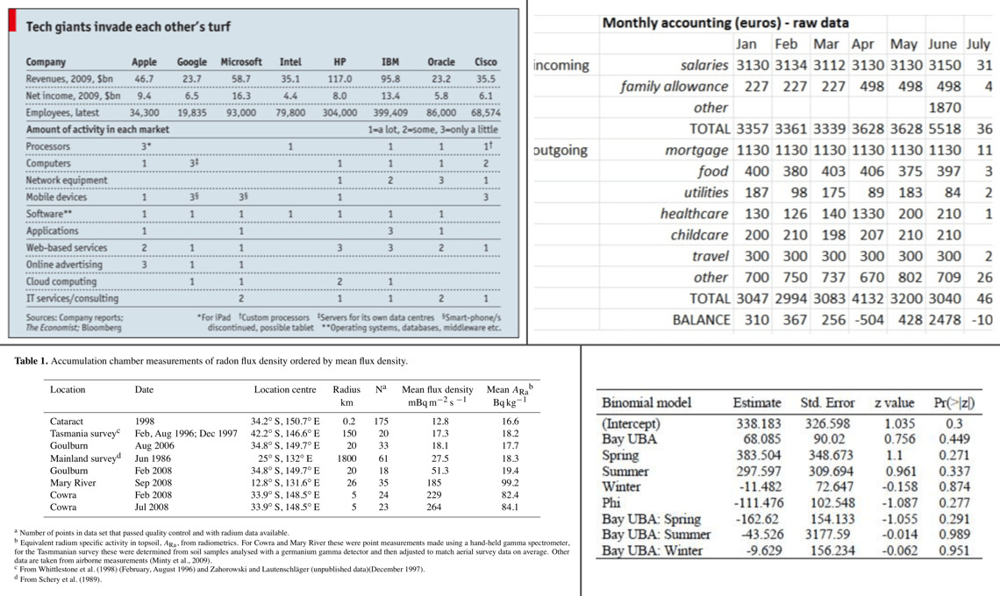
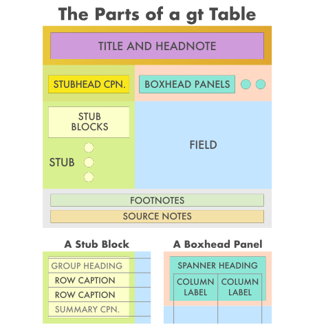

```{r options, message=FALSE, warning=FALSE, include=FALSE}
knitr::opts_chunk$set(
  collapse = TRUE,
  comment = "#>"
)

library(gt)
library(dplyr)
```

The **gt** package is all about making it simple to produce nice-looking display tables. Display tables? Well yes, we are trying to distinguish between data tables (e.g., tibbles, `data.frame`s, etc.) and those tables you'd find in a web page, a journal article, or in a magazine. Such tables can likewise be called presentation tables, summary tables, or just tables really. Here are some examples, ripped straight from the web:



We can think of display tables as output only, where we'd not want to use them as input ever again. Other features include annotations, table element styling, and text transformations that serve to communicate the subject matter more clearly.

### A Walkthrough of the **gt** Basics with a Simple Table

Let's use a less common dataset that is available in the R **datasets** package: `islands`. It's actually not a data frame but a named vector. That's okay though, we can use use **dplyr** and prepare a tibble from it:

```{r}
# Take the `islands` dataset and use some
# dplyr functionality to obtain the ten
# biggest islands in the world
islands_tbl <-
  tibble(
    name = names(islands),
    size = islands
  ) |>
  slice_max(size, n = 10)

# Display the table
islands_tbl
```

Given that `islands_tbl` is a tibble, we now have a suitable input for **gt**. 

The main entry point into the **gt** API is the `gt()` function. If we pass `islands_tbl` to the *function* `gt()`, we'll get a **gt Table** as output. As an aside, we could have easily used a data frame instead as valid **Table Data** for **gt**.

```{r simple_gt_table}
# Create a display table showing ten of
# the largest islands in the world
gt_tbl <- gt(islands_tbl)

# Show the gt Table
gt_tbl
```

That doesn't look too bad. Sure, it's basic but we really didn't really ask for much. We did receive a proper table with column labels and the data. Also, that default striping is a nice touch. Oftentimes however, you'll want a bit more: a **Table header**, a **Stub**, and sometimes *footnotes* and *source notes* in the **Table Footer** part.

### Adding Parts to this Simple Table

The **gt** package makes it relatively easy to add parts so that the resulting **gt Table** better conveys the information you want to present. These table parts work well together and there the possible variations in arrangement can handle most tabular presentation needs. The previous **gt Table** demonstrated had only two parts, the **Column Labels** and the **Table Body**. The next few examples will show all of the other table parts that are available.

This is the way the main parts of a table (and their subparts) fit together:

<p align="center"></p>

The parts (roughly from top to bottom) are:

- the **Table Header** (optional; with a **title** and possibly a **subtitle**)
- the **Stub** and the **Stub Head** (optional; contains *row labels*, optionally within *row groups* having *row group labels* and possibly *summary labels* when a summary is present)
- the **Column Labels** (contains *column labels*, optionally under *spanner column labels*)
- the **Table Body** (contains *columns* and *rows* of *cells*)
- the **Table Footer** (optional; possibly with **footnotes** and **source notes**)

The way that we add parts like the **Table Header** and *footnotes* in the **Table Footer** is to use the `tab_*()` family of functions. A **Table Header** is easy to add so let's see how the previous table looks with a **title** and a **subtitle**. We can add this part using the `tab_header()` function:

```{r table_with_heading}
# Make a display table with the `islands_tbl`
# table; put a heading just above the column labels
gt_tbl <-
  gt_tbl |>
  tab_header(
    title = "Large Landmasses of the World",
    subtitle = "The top ten largest are presented"
  )

# Show the gt Table
gt_tbl
```

The **Header** table part provides an opportunity to describe the data that's presented. The `subtitle`, which functions as a subtitle, is an optional part of the **Header**. We may also style the `title` and `subtitle` using Markdown! We do this by wrapping the values passed to `title` or `subtitle` with the `md()` function. Here is an example with the table data truncated for brevity:

```{r heading_w_markdown}
# Use markdown for the heading's `title` and `subtitle` to
# add bold and italicized characters
gt(islands_tbl[1:2, ]) |>
  tab_header(
    title = md("**Large Landmasses of the World**"),
    subtitle = md("The *top two* largest are presented")
  )
```

A **source note** can be added to the table's **footer** through use of `tab_source_note()`. It works in the same way as `tab_header()` (it also allows for Markdown inputs) except it can be called multiple times---each invocation results in the addition of a source note.

```{r}
# Display the `islands_tbl` data with a heading and
# two source notes
gt_tbl <-
  gt_tbl |>
  tab_source_note(
    source_note = "Source: The World Almanac and Book of Facts, 1975, page 406."
  ) |>
  tab_source_note(
    source_note = md("Reference: McNeil, D. R. (1977) *Interactive Data Analysis*. Wiley.")
  )

# Show the gt table
gt_tbl
```

Footnotes live inside the **Footer** part and their footnote marks are attached to cell data. Footnotes are added with `tab_footnote()`. The helper function `cells_body()` can be used with the `location` argument to specify which data cells should be the target of the footnote. `cells_body()` has the two arguments `columns` and `rows`. For each of these, we can supply (1) a vector of colnames or rownames, (2) a vector of column/row indices, (3) bare column names wrapped in `c()` or row labels within `c()`, or (4) a select helper function (`starts_with()`, `ends_with()`, `contains()`, `matches()`, `all_of()`, and `everything()`). For `rows` specifically, we can use a conditional statement with column names as variables (e.g., `size > 15000`).

Here is a simple example on how a footnotes can be added to a table cell. Let's add a footnote that references the `North America` and `South America` cells in the `name` column:

```{r table_footnote_simple}
# Add footnotes (the same text) to two different
# cell; data cells are targeted with `data_cells()`
gt_tbl <-
  gt_tbl |>
  tab_footnote(
    footnote = "The Americas.",
    locations = cells_body(columns = name, rows = 3:4)
  )

# Show the gt table
gt_tbl
```

Here is a slightly more complex example of adding footnotes that use expressions in `rows` to help target cells in a column by the underlying data in `islands_tbl`. First, a set of **dplyr** statements obtains the name of the 'island' by largest landmass. This is assigned to the `largest` object and is used in the first `tab_footnote()` call that targets the cell in the `size` column that is next to a `name` value that is stored in `largest` ('Asia'). The second `tab_footnote()` is similar except we are supplying a conditional statement that gets the lowest population.

```{r}
# Determine the row that contains the
# largest landmass ('Asia')
largest <-
  islands_tbl |>
  slice_max(size, n = 1) |>
  pull(name)

# Create two additional footnotes, using the
# `columns` and `where` arguments of `data_cells()`
gt_tbl <-
  gt_tbl |>
  tab_footnote(
    footnote = md("The **largest** by area."),
    locations = cells_body(
      columns = size,
      rows = name == largest
    )
  ) |>
  tab_footnote(
    footnote = "The lowest by area.",
    locations = cells_body(
      columns = size,
      rows = size == min(size)
    )
  )

# Show the gt table
gt_tbl
```

We were able to supply the reference locations in the table by using the `cells_body()` helper function and supplying the necessary targeting through the `columns` and `rows` arguments. Other `cells_*()` functions have similar interfaces and they allow us to target cells in different parts of the table.

### The Stub

The **Stub** is the area to the left in a table that contains *row labels*, and may contain *row group labels*, and *summary labels*. Those subparts can be grouped in a sequence of *row groups*. The **Stub Head** provides a location for a label that describes the **Stub**. The **Stub** is optional since there are cases where a **Stub** wouldn't be useful (e.g., the display tables presented above were just fine without a **Stub**).

An easy way to generate a **Stub** part is by specifying a stub column in the `gt()` function with the `rowname_col` argument. This will signal to **gt** that the named column should be used as the stub, making *row labels*. Let's add a stub with our `islands_tbl` dataset by modifying the call to `gt()`:

```{r}
# Create a gt table showing ten of the
# largest islands in the world; this
# time with a stub
gt_tbl <-
  islands_tbl |>
  gt(rowname_col = "name")

# Show the gt table
gt_tbl
```

Notice that the landmass names are off the left in an unstriped area? That's the **stub**. We can apply what's known as a **stubhead label**. This label can be added with `tab_stubhead()`:

```{r}
# Generate a simple table with a stub
# and add a stubhead label
gt_tbl <-
  gt_tbl |>
  tab_stubhead(label = "landmass")

# Show the gt table
gt_tbl
```

A very important thing to note here is that the table now has one column. Before, when there was no **stub**, two columns were present (with **column labels** `name` and `size`) but now column number `1` (the only column) is `size`.

To apply our table parts as before (up to and including the footnotes) we use the following statements:

```{r}
# Display the `islands_tbl` data with a stub,
# a heading, source notes, and footnotes
gt_tbl <-
  gt_tbl |>
  tab_header(
    title = "Large Landmasses of the World",
    subtitle = "The top ten largest are presented"
  ) |>
  tab_source_note(
    source_note = "Source: The World Almanac and Book of Facts, 1975, page 406."
  ) |>
  tab_source_note(
    source_note = md("Reference: McNeil, D. R. (1977) *Interactive Data Analysis*. Wiley.")
  ) |>
  tab_footnote(
    footnote = md("The **largest** by area."),
    locations = cells_body(
      columns = size, rows = largest
    )
  ) |>
  tab_footnote(
    footnote = "The lowest by population.",
    locations = cells_body(
      columns = size, rows = contains("arc")
    )
  )

# Show the gt table
gt_tbl
```

Let's incorporate row groups into the display table. This divides rows into groups, creating *row groups*, and results in a display of a *row group labels* right above the each group. This can be easily done with a table containing row labels. We can make a new *row group* with each `tab_row_group()` call. The inputs are row group names in the `label` argument, and row references in the `rows` argument. We can use any of the strategies to reference rows as we did we footnotes (e.g., vectors of names/indices, select helpers, etc.).

Here we will create three row groups (with row group labels `continent`, `country`, and `subregion`) to have a grouping of rows.

```{r}
# Create three row groups with the
# `tab_row_group()` function
gt_tbl <-
  gt_tbl |>
  tab_row_group(
    label = "continent",
    rows = 1:6
  ) |>
  tab_row_group(
    label = "country",
    rows = c("Australia", "Greenland")
  ) |>
  tab_row_group(
    label = "subregion",
    rows = c("New Guinea", "Borneo")
  )

# Show the gt table
gt_tbl
```

Three *row groups* have been made since there are three unique categories under `groupname`. Across the top of each *row group* is the *row group label* contained in a separate row (these cut across the field and they contain nothing but the *row group label*). A rearrangement of rows is carried out to ensure each of the rows is collected within the appropriate *row groups*.

Having groups of rows in *row groups* is a great way to present information. Including data summaries particular to each group is a natural extension of this idea. This process of adding summary rows with *summary labels* is covered in a separate article (*Creating Summary Lines*).

Another way to make row groups is to have a column of group names present in the input data table. For our above example with `islands_tbl`, having a `groupname` column with the categories `continent`, `country`, and `subregion` in the appropriate rows would produce row groups when using the `gt()` function's `groupname_col` argument (e.g., `gt(islands_tbl, rowname_col = "name", groupname_col = "groupname") |> ...`). Then, there would be no need to use `tab_row_group()`. This strategy of supplying group names in a column can sometimes be advantageous since we can rely on functions such as those available in **dplyr** to generate the categories (e.g., using `case_when()` or `if_else()`).

### The Column Labels

The table's **Column Labels** part contains, at a minimum, columns and their *column labels*. The last example had a single column: `size`. Just as in the **Stub**, we can create groupings called *spanner columns* that encompass one or more columns. 

To better demonstrate how **Column Labels** work and are displayed, let's use an input data table with more columns. In this case, that input table will be `airquality`. It has the following columns:

- `Ozone`: mean ground-level ozone in parts per billion by volume (ppbV), measured between 13:00 and 15:00
- `Solar.R`: solar radiation in Langley units (cal/m<sup>2</sup>), measured between 08:00 and noon
- `Wind`: mean wind speed in miles per hour (mph)
- `Temp`: maximum daily air temperature in degrees Fahrenheit (&deg;F)
- `Month`, `Day`: the numeric month and day of month for the record

We know that all measurements took place in 1973, so a `year` column will be added to the dataset before it is passed to `gt()`. 

Let's organize the time information under a `Time` *spanner column label*, and put the other columns under a `Measurement` *spanner column label*. We can do this with `tab_spanner()`.

```{r}
# Modify the `airquality` dataset by adding the year
# of the measurements (1973) and limiting to 10 rows
airquality_m <-
  airquality |>
  mutate(Year = 1973L) |>
  slice(1:10)

# Create a display table using the `airquality`
# dataset; arrange columns into groups
gt_tbl <-
  gt(airquality_m) |>
  tab_header(
    title = "New York Air Quality Measurements",
    subtitle = "Daily measurements in New York City (May 1-10, 1973)"
  ) |>
  tab_spanner(
    label = "Time",
    columns = c(Year, Month, Day)
  ) |>
  tab_spanner(
    label = "Measurement",
    columns = c(Ozone, Solar.R, Wind, Temp)
  )

# Show the gt table
gt_tbl
```

We can do two more things to make this presentable:

- move the `Time` columns to the beginning of the series (using `cols_move_to_start()`)
- customize the column labels so that they are more descriptive (using `cols_label()`)

Let's do both of these things in the next example.

```{r}
# Move the time-based columns to the start of
# the column series; modify the column labels of
# the measurement-based columns
gt_tbl <-
  gt_tbl |>
  cols_move_to_start(
    columns = c(Year, Month, Day)
  ) |>
  cols_label(
    Ozone = html("Ozone,<br>ppbV"),
    Solar.R = html("Solar R.,<br>cal/m<sup>2</sup>"),
    Wind = html("Wind,<br>mph"),
    Temp = html("Temp,<br>&deg;F")
  )

# Show the gt table
gt_tbl
```

Note that even though columns were moved using `cols_move_to_start()`, the *spanner column labels* still spanned above the correct *column labels*. There are a number of functions that **gt** provides to move columns, including `cols_move()`, `cols_move_to_end()`; there's even a function to hide columns: `cols_hide()`.

Multiple columns can be renamed in a single use of `cols_label()`. Further to this, the helper functions `md()` and `html()` can be used to create column labels with additional styling. In the above example, we provided column labels as HTML so that we can insert linebreaks with `<br>`, insert a superscripted `2` (with `<sup>2</sup>`), and insert a degree symbol as an HTML entity (`&deg;`).
